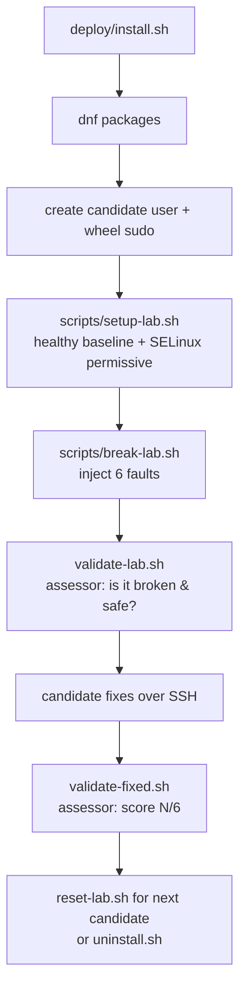

# Architecture

## Purpose

A self-contained Linux troubleshooting lab for **AlmaLinux 10**. A single host
is provisioned into a deliberately broken state that resembles a small internal
web server that has fallen over. A candidate is given SSH access and asked to
diagnose and restore service using ordinary Linux administration skills.

The repository is the engineering source of truth: it provisions the host,
breaks it in a controlled and safe way, validates the broken state before a
candidate starts, and scores the result afterwards.

## Scenario

> An internal web service on this server is down. Restore it. Along the way you
> will find the host is unhealthy in several other ways. Fix what a real
> on-call engineer would fix.

Six independent faults are injected. They are layered (some objectives require
fixing more than one root cause) so the exercise rewards diagnosis over
checklist-following.

## Components

| Component | Role |
|---|---|
| `lab/lib/common.sh` | Shared constants + helpers (incl. firewalld helpers). Single source of truth for paths/ports so breakage and validation can never drift. |
| `lab/files`, `lab/services`, `lab/configs` | Healthy templates installed by `setup-lab.sh`. The fixed target equals these. |
| `scripts/setup-lab.sh` | Builds the healthy baseline (idempotent); sets SELinux permissive. |
| `scripts/break-lab.sh` | Applies the six faults on top of the baseline. |
| `scripts/validate-lab.sh` | Pre-candidate: confirms the lab is broken **and safe**. |
| `scripts/validate-fixed.sh` | Post-candidate: behavioural scoring, `N/6`. |
| `deploy/install.sh` | One-shot installer: dnf packages → candidate user → setup → break. |
| `deploy/reset-lab.sh` | Re-break for the next candidate (setup → break). |
| `deploy/uninstall.sh` | Remove all lab artifacts. |
| `deploy/healthcheck.sh` | Admin snapshot of host state. |

## Control flow

## Fault matrix

| # | Objective | Root cause(s) injected | Primary clue | Broken signal | Fixed signal |
|---|---|---|---|---|---|
| A | Web reachable on :80 | nginx `listen` set to 8080; **and** firewalld blocks HTTP | `ss -ltnp`, `curl`, `firewall-cmd --list-all` | `curl :80` refused; firewalld active, http not allowed | `curl :80` = 200 **and** firewalld allows http |
| B | `app.service` runs | `app.sh` not executable; **and** `/opt/app` not writable by `appuser` | `systemctl status`, `journalctl -u app` | unit not active (203/EXEC then perm error) | unit active and stays up |
| C | DNS resolution | `/etc/resolv.conf` points at an unroutable nameserver (`192.0.2.53`) | `cat /etc/resolv.conf`, `getent hosts` | name lookups time out | a known hostname resolves |
| D | Log rotation | logrotate glob points at a non-existent dir (`/var/log/appp`) and drops `copytruncate` | `/etc/logrotate.d/app`, `logrotate -d` | forced rotation does nothing; log grows | forced rotation produces `app.log.1*` |
| E | CPU hog | `/etc/cron.d/cpuhog` respawns a `yes` process every minute | `top`, `pgrep`, `/etc/cron.d` | runaway `yes`; returns after kill | no `yes`, cron entry removed |
| F | Disk pressure | size-aware large file at `/var/log/verbose-debug.log` | `df -h`, `du -xhd1 /var/log` | root fs ≥ 85% | file removed, usage healthy |

Faults are mutually independent: fixing one neither fixes nor breaks another.

## Safety model

The lab runs on a public VPS, so two faults are deliberately bounded:

- **Firewall (A):** firewalld always permits SSH before HTTP is removed. The
  candidate cannot be locked out, and neither can the admin.
- **Disk (F) assumes a single root filesystem.** The fault measures and fills
  `/`, placing the file under `/var/log`. This works on standard DigitalOcean
  droplets (one partition). If `/var` or `/var/log` were a *separate* mount, the
  file would not create pressure on `/` and the fault would be weakened.
- **Disk (F):** the large file is sized from live free space. It never pushes
  the root filesystem past `DISK_MAX_PCT` (92%) and always leaves at least
  `DISK_SAFETY_FREE_BYTES` (~1.5 GiB) free. If the disk is too small to do this
  safely, fault F is skipped with a warning rather than risking a full disk.
  `LAB_MAX_BIGFILE_BYTES` can cap the file further (used in container testing).

SSH configuration is never itself a fault — that would risk lockout. SELinux is
set permissive so it does not become an unintended fault. See `docs/SECURITY.md`.

## Design trade-offs

- **Templates vs. inline generation.** Healthy state lives in `lab/` templates;
  faults are mutations of that state. This makes the "fixed" target reviewable
  and lets reset reuse setup.
- **Behavioural grading.** `validate-fixed.sh` tests behaviour (HTTP 200, unit
  active, real DNS lookup, a forced rotation) rather than grepping config text,
  so a candidate who fixes the symptom a different-but-valid way still scores.
- **Single main nginx.conf.** `setup-lab.sh` installs a minimal `nginx.conf`
  (original backed up) so the lab's `conf.d/lab.conf` is the only server block
  and there is no duplicate `default_server` from the stock config.

## Known limitations

- DNS fault C and the post-fix DNS check assume the droplet has outbound
  internet (true on DigitalOcean).
- Fault F is skipped on pathologically small/full disks (documented warning).
- The lab assumes a single host; it is not designed for multi-node scenarios.
- The original single-file AlmaLinux script is preserved on branch
  `archived-almalinux-attempt`. `main` is the current modular AlmaLinux 10
  design.
